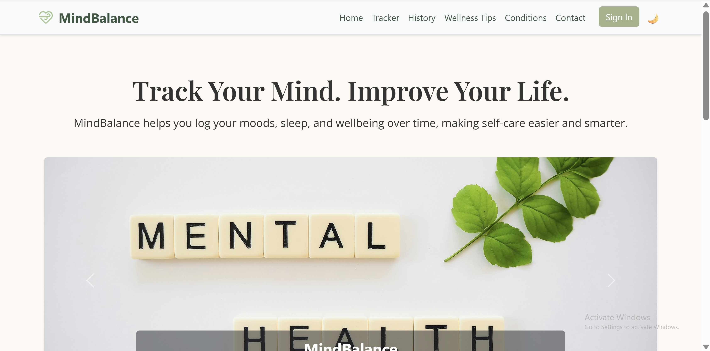
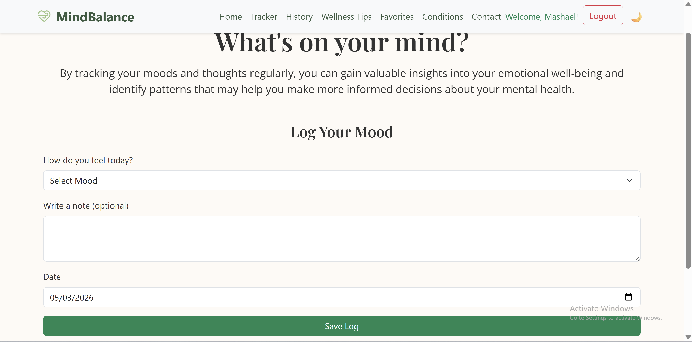
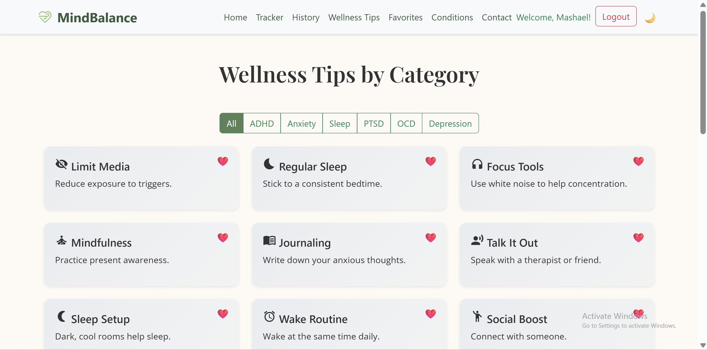
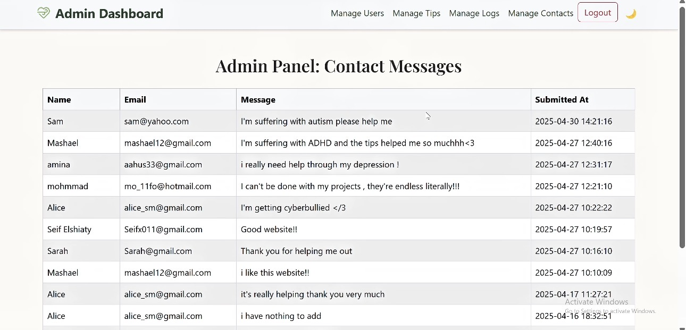

# MindBalance – Mental Health Tracking Web App

## Overview
MindBalance is a full-stack web application designed to help users track their mental health, monitor mood patterns, and access wellness resources in a secure and structured environment.

---

## Features
- User authentication system (register/login)
- Mood tracking with history logs
- Edit and delete mood entries
- Save favorite wellness tips
- Admin dashboard (manage users, tips, logs)
- Contact system with specialist recommendations
- Mental health conditions information page
- Dark mode support

---

## Technologies Used
- PHP
- MySQL / MariaDB
- HTML / CSS / JavaScript
- Bootstrap 5

---

## Project Structure
```
assets/        → images  
database/      → SQL file  
screenshots/   → UI previews  
*.php          → application pages  
styles.css     → styling  
```

---

## Database
The database file is included:

```
database/mindbalance_db.sql
```

---

## How to Run

1. Install XAMPP (or any PHP server)
2. Move project to:

```
htdocs/
```

3. Start Apache & MySQL
4. Open phpMyAdmin
5. Create database:

```
mindbalance_db
```

6. Import:

```
database/mindbalance_db.sql
```

7. Update `db_connect.php` with your credentials
8. Open:

```
http://localhost/MindBalance-Web-App
```

---

## Screenshots

### Home Page


### Mood Tracker


### Wellness Tips


### Admin Dashboard


---

## Future Improvements
- AI-based mood analysis
- Notifications system
- Mobile optimization

---

## Authors
- Mashael Saeed  
- Sarah Elshiaty  
- Seifeldin Elshiaty
